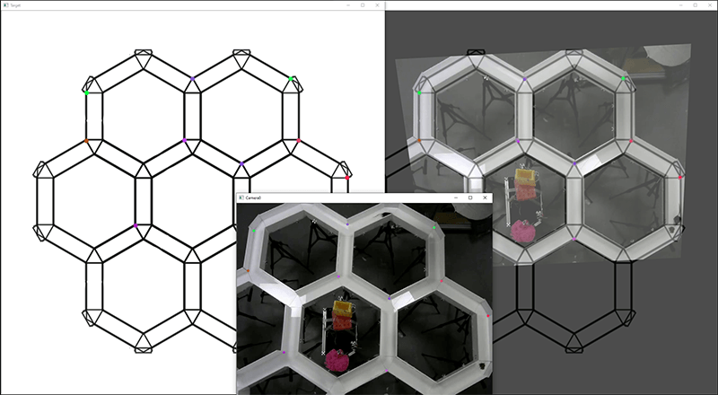

# Stitching Videos

## Calculate alignment matrix
For each camera angle we need to pre-calculate the transformation matrix with the GUI tool. Start the GUI with
    
    `python align_gui.py --target [target image path] [source image path]`

where the target image is a ground-truth image of a flat top-down view on the maze
For example:

    `python align_gui.py --target "D:\data\targets\mouse_hexmaze.png" "D:\data\2018-10-02_04-40-59_cam_0.avi"`
    

   
The GUI should open three windows. One is the target image, one the source camera view, and one a preview. Double click
on a point in the target view, a colored dot appears marking the location. Double click on the corresponding location
in the source view. A dot with the same color should appear there, too. The dots should all represent locations in a
single plane, for example the floor of the maze. This is important!

Once three such points where added, the preview should update and show you the current estimate, but will only align
well when at least four point pairs were added. When you are happy with the alignment, press `s` on the keyboard to
save, and `q` to quit. The transformation (homography) matrix, label and preview images are stored alongside the 
original files. Check they are ok.

Repeat for all cameras/videos.

## Stitch images
With the precalculted transformation matrix the images can now be perspective corrected and merged.

`python stitch.py [sources]`

Sources should be paths all camera views. To make it easier, if they all have the same name and just different camera 
number as is usually the case, the source can be specified with a wildcard, either `?` or  `*`. For example:

`python stitch.py "D:\data\2018-10-02_04-40-59_cam_*.avi"`

Additional parameters of note are `--preview`, giving you a preview of what happens. This is great to tune in on a final
look, but slows processing down. `--cropx` and `--cropy` allow to trim the borders of the image. `--delays` allows to 
either start the video in the middle instead of the start, but also to compensate for temporal lag between the cameras.
If `--delay` is used it must be specified for each source. E.g. for a two camera set of videos `--delay 0 0`.
Together with `--num_frames` to limit the number of frames to be extracted, segments in the middle of a session can be
extracted.